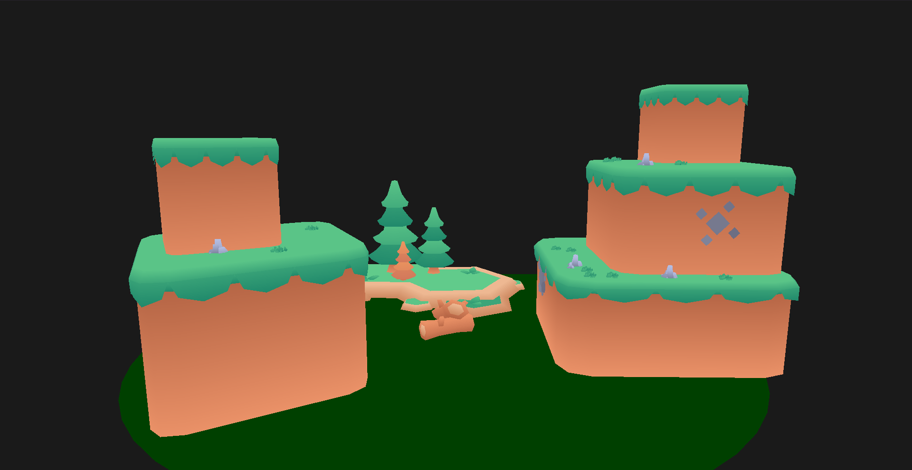

# tarefas
- [x] inicializar git
- [x] refatorar código
- [x] escolher cenário
- [x] criar cenário
- [x] fazer readme.md
  - [x] intro
  - [x] ferramentas usadas
    - [x] linguagem
    - [x] biblioteca
    - [x] git
    - [x] links de modelos
  - [x] como botar algo no cenário
    - [x] usando .obj e jpg
    - [x] usando figuras geométricas 2d no geral
    - [x] usando figuras geométricas equiláteras
    - [x] como rodar
      - [x] qual pasta tem que estar aberta no terminal 
      - [x] comando de terminal
        - [x] como usar uma venv zerada
          - [x] como usar o requirements.txt
        - [x] como inicializar o programa
- [x] subir no github

## opcional:
- [ ] fazer camera rodando até o usuário clicar em algo
- [ ] fazer docstring
- [ ] transformar a parte da engine num pacote
  - [ ] separar a inicialização de uma instância da geração da figura
    - [ ] objetos
    - [ ] figuras geométricas
    - [ ] figuras geométricas equilateras
  - [ ] mandar gerar a figura no Application.run()
  - [ ] botar a inicialização das instâncias dos objetos na main

# Floresta Gráfica 3D

Projeto desenvolvido em Python utilizando OpenGL para renderização de ambientes tridimensionais, modelos OBJ, texturas e transformações geométricas.

## Objetivo

Desenvolver uma cena tridimensional interativa utilizando conceitos de Computação Gráfica, incluindo:

- Modelagem geométrica
- Transformações 3D
- Pipeline gráfico
- Renderização com OpenGL
- Aplicação de texturas
- Importação de modelos externos
- Navegação por câmera

## Demonstração

### Cena Principal



## Como Executar

1. Clonar repositório
   ```shell
      git clone https://github.com/nyxbarros/floresta_grafica_python.git
      cd floresta_grafica_python
   ```
2. Criar ambiente virtual
   * Linux
     ```shell
     python -m venv venv
     source venv/bin/activate
     ```
   * Windows
     ```shell
     python -m venv venv
     venv\Scripts\activate
     ```
3. Instalar dependências
    ```shell
    pip install -r requirements.txt
    ```

4. Executar
    ```shell
    python src/main.py
    ```

## Como Criar Cenário
1. Carregar todos os arquivos `.obj` e seus arquivos de texturas na pasta src/objetos/
2. Acessar arquivo `src/objetos/objetos.py`
3. No metodo Objetos.gerar(), é onde se deve acrescentar os objetos e as suas configurações (selecionando coordenadas, textura, rotação, translação e escala), os objetos configurados devem ser adicionados a lista `Objetos.__lista_objetos`
   * Existem 2 tipos principais de objetos possíveis de ser carregado aqui, os do tipo Model (aos quais obtém coordenadas por meio de um `.obj` e a sua textura de um arquivo de imagem) e os do tipo FiguraGeometrica/FiguraGeometricaEquilatera (aos quais obtém coordenadas por meio de uma lista python e a sua textura de uma lista com 3 valores do tipo `float`, gerando um RGB para o objeto)


### Cotrole

| Tecla | Ação              |
| ----- | ----------------- |
| W     | Frente            |
| S     | Trás              |
| A     | Esquerda          |
| D     | Direita           |
| Mouse | Rotação da câmera |
| ESC   | Sair              |

## Funcionalidades

### Ambiente 3D
* Terreno renderizado em OpenGL
* Objetos distribuídos proceduralmente
* Sistema de câmera livre

### Objetos
* Árvores
* Troncos
* Pedras
* Vegetação
* Estruturas decorativas

### Modelos 3D
Importação de modelos no formato:
* OBJ
* MTL
* PNG (texturas)

Pacotes de objetos 3d utilizados:
* [Kenney Cube Pets](https://kenney.nl/assets/cube-pets)
* [Kenney Fantasy Town Kit](https://kenney.nl/assets/fantasy-town-kit)
* [Kenney Graveyard Kit](https://kenney.nl/assets/graveyard-kit)
* [Kenney Pirate Kit](https://kenney.nl/assets/pirate-kit)
* [Kenney Survival Kit](https://kenney.nl/assets/survival-kit)
* [Kenney Tower Defense Kit](https://kenney.nl/assets/tower-defense-kit)

### Transformações
Cada objeto suporta:
* Translação
* Rotação
* Escala

através da matriz de modelo (Model Matrix).

## Estrutura do Projeto

```text
.
├── main.py
│
├── engine/
│   ├── application.py
│   ├── camera.py
│   ├── color_shader.py
│   ├── figuras_geometricas.py
│   ├── model.py
│   ├── obj_loader_simple.py
│   ├── shader.py
│   ├── shape.py
│   ├── textured_shader.py
│   └── texture_loader.py
│
└── objetos/
    ├── objetos.py
    ├── kenney_cube-pets_1.0/
    ├── kenney_fantasy-town-kit_2.0/
    ├── kenney_graveyard-kit_5.0/
    ├── kenney_pirate-kit/
    ├── kenney_platformer-kit/
    ├── kenney_survival-kit/
    └── kenney_tower-defense-kit/
```

### Organização dos Módulos

#### main.py

Ponto de entrada da aplicação. Responsável por iniciar a janela OpenGL, configurar a cena e executar o loop principal de renderização.

#### engine/

Contém os componentes responsáveis pela renderização e manipulação gráfica.

- `application.py` — gerenciamento da aplicação e loop principal.
- `camera.py` — implementação da câmera 3D.
- `shader.py` — carregamento e compilação de shaders GLSL.
- `color_shader.py` — shader para objetos coloridos.
- `textured_shader.py` — shader para objetos texturizados.
- `model.py` — carregamento e renderização de modelos 3D.
- `obj_loader_simple.py` — parser de arquivos OBJ.
- `texture_loader.py` — carregamento de texturas PNG.
- `shape.py` — abstrações para objetos renderizáveis.
- `figuras_geometricas.py` — geração de primitivas geométricas.

#### objetos/

Biblioteca de assets 3D utilizada na construção da cena.

Os modelos foram obtidos de diferentes pacotes da Kenney e incluem:

- árvores
- pedras
- vegetação
- estruturas
- objetos decorativos

O arquivo `objetos.py` centraliza a definição e instanciação dos objetos presentes na cena.

## Fluxo de Renderização

```text
OBJ/MTL
    ↓
ObjLoaderSimple
    ↓
VBO / VAO
    ↓
Shader GLSL
    ↓
Model Matrix
    ↓
View Matrix
    ↓
Projection Matrix
    ↓
OpenGL
    ↓
Tela
```
